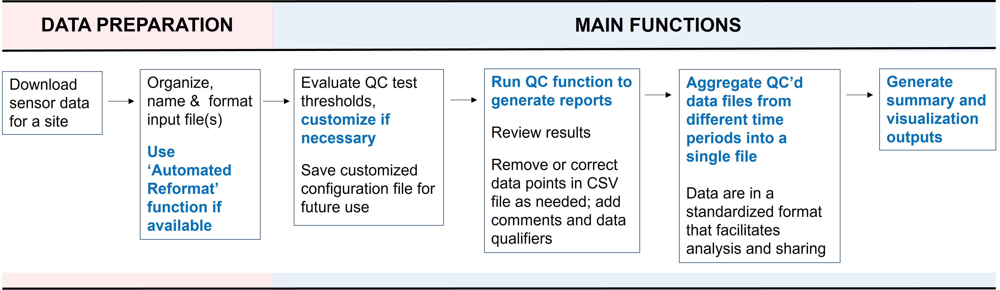

```{r setup, include=FALSE}
knitr::opts_chunk$set(results='asis', echo=FALSE, warning=FALSE, message = FALSE, fig.align="center")
# needed for trouble shooting
boo_DEBUG <- FALSE
if(boo_DEBUG==TRUE){
  # myConfig <- file.path(system.file(package="ContDataQC"), "extdata", "config.ORIG.R")
  # source(myConfig)
}## IF ~ boo_DEBUG ~ END
```

# About ContDataQC

The ContDataQC Shiny app is a free R-based tool that was developed to help water
quality monitoring programs QC, merge and summarize continuous sensor data files
in a standardized, more efficient way. It also has a function that allows users 
to download U.S. Geological Survey gage data at sites and over periods of their 
choosing. This Shiny app is linked to the ContDataQC R package, which was 
developed by Erik W. Leppo from Tetra Tech (Erik.Leppo@tetratech.com) and is 
available on <a href="https://github.com/leppott/ContDataQC" target="_blank">GitHub</a>.

The ContDataQC R package and Shiny app were developed with the following objectives in mind: ensure that a certain (minimum) level of QC is being performed on continuous data files; standardize and speed up data QC and reduce missed errors; and standardize data for further analysis and sharing.  ContDataQC is configured for temperature, water level, discharge, conductivity, pH, turbidity, chlorophyll-a and salinity data. Users with advanced R skills can add any other parameters that they desire by making edits to the configuration file, which can be viewed in R or in Notepad.

# ContDataQC Shiny App Workflow

The figure below lays out the general workflow for using the ContDataQC R tools. Items in bold blue text show functions that can be performed with ContDataQC.

Want to try it yourself? Click [here](Custom_QC_Config_ECO66G20_test1.R) to 
download test files.

{width=95%}

# Funding

Development of the ContDataQC R tools has been funded by the United States 
Environmental Protection Agency (EPA) Office of Research and Development (ORD) 
as part of a larger project to establish Regional Monitoring Networks (RMNs) for
freshwater streams and inland lakes (lead EPA scientist: Britta Bierwagen). The 
RMNs are a volunteer, collaborative effort in which entities collect long-term 
continuous temperature and hydrologic data at targeted sites to detect changes 
over time. For more information on the RMNs, please refer to the 
<a href="https://cfpub.epa.gov/ncea/global/recordisplay.cfm?deid=307973" target="blank">stream Regional Monitoring Networks report</a>.

