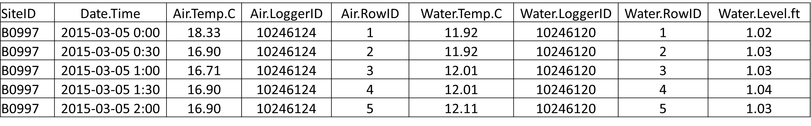

```{r setup, include=FALSE}
knitr::opts_chunk$set(results='asis', echo=FALSE, warning=FALSE, message = FALSE)
# needed for trouble shooting
boo_DEBUG <- FALSE
if(boo_DEBUG == TRUE){
  # myConfig <- file.path(system.file(package="ContDataQC"), "extdata", "config.ORIG.R")
  # source(myConfig)
}## IF ~ boo_DEBUG ~ END
```

# HOBOware Reformat

The HOBOware reformat function is for data files from Onset HOBO sensors. It converts them to a format that is ready to run through the QC report function (**Main Functions >> Run Functions >> QC raw data (from drop-down menu)**). This saves you time and eliminates errors that sometimes occur when manually reformatting files.

HOBO sensor files must first be opened with HOBOware software, then processed and exported as CSV files. The instructions in the files below describe how to generate CSV files, allowing you to run them through the reformat function without manipulation:

*	[HOBOware default settings](HOBOware_DefaultSettings_20220824.pdf) [PDF]

*	[Temperature (proV2)](HOBOware_Temperature_20220825.pdf) [PDF]

*	[Water level (U20 series)](HOBOware_WaterLevel_U20_20220824.pdf) [PDF]

*	[Dissolved oxygen (U26)](HOBOware_DO_20220824.pdf) [PDF]

### Instructions

*	Export CSV files from HOBOware (following the instructions above for whichever sensor type(s) you have) and place them into the Data0_Original folder.

*	Choose your file by clicking the ‘Browse’ button and selecting the input file(s). You can run multiple files at once. The status bar will tell you when the upload is complete.

*	Select the Date format in your input file (options: YMD, MDY, DMY)

*	After you select your input file click the ‘Reformat HOBOware file(s)’ button that appears; a status bar will appear in the lower right corner.

*	After the function is done running, a ‘Download’ button will appear. Click this button.

* You will be prompted to save a zipped file named ‘format_HOBO_date_time’. Save the zipped file in the Data1_RAW folder.

*	Unzip/extract the file(s) or the files won’t be seen as an option to upload to the QC report function (**Main Functions >> Run Functions >> QC raw data (from drop-down menu)**). After file is unzipped, a new folder called ‘HOBO’ will appear. The original zipped file can be deleted if desired.

Time-saver tip: some internet browsers, like Google Chrome and Mozilla Firefox, allow users to change settings so that users can select which folder to download files to (versus files going to the default Download folder).

*	Mozilla Firefox: go to Settings > General > Files and Applications > Check box for “always ask where to save files.” 
* [Google Chrome file saving tip](GoogleChrome_TimesaverTips.pdf) [PDF] 

Your files are now ready to be run through the QC function!
Below are examples of what HOBO U20 CSV files look like before and after they are run through the reformat function. The reformat function does the following:

*	Changes column headings, as needed.

*	Creates a new ‘SiteID’ column and populates it with the SiteID that it takes from the first part of the input file name (the SiteID should precede the first underscore in the file name).

*	Creates RowID columns for air and water sensors.

*	Creates LoggerID fields for air and water sensors based on the LGR S/N entries in the column headings.

*	Removes the first row (Plot Title).

If there is a problem with the input file, the screen will turn gray and it will say ‘disconnected from the server’ in the lower left.


## Example
Example input to and output from running the HOBOware reformat function on a HOBO U20 water level logger file:

**Before**

```{r, fig.alt="HOBO U-20 file before running the reformat function"}

```

**After**

```{r, fig.alt="HOBO U-20 file after running the reformat function."}

```

## Additional Notes

* If you enter the wrong date format, the function will still run but your date field will be blank and you will not receive an error message. We recommend checking your output files to make sure the date field came through, as well as the other desired parameters (if those are not named correctly, they will be missing from the output file and you will not receive an error message).

*	Unwanted ‘logged’ text entries in the bottom row of the CSV: these occur if you forget to uncheck the ‘select internal logger events to plot’ boxes during Plot SetUp in HOBOware.

*	Two serial numbers in the column heading (you should only have one): make sure under Preferences-Export settings, you only have the ‘include logger serial number’ box checked, NOT the ‘include sensor serial number or label if available’ box).
