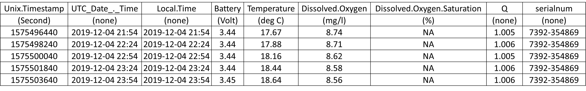
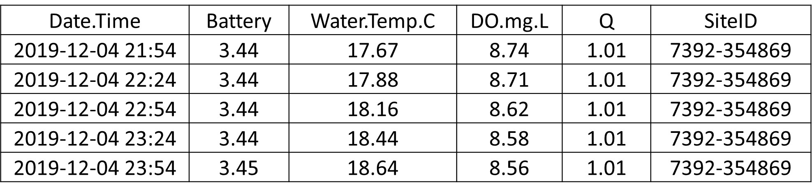

```{r setup, include=FALSE}
# ---
# title: "DataPrep_miniDOT_Reformat"
# date: '2022-06-01'
# ---
knitr::opts_chunk$set(echo = FALSE)
```

# miniDOT DO Reformat

After the daily files are concatenated, run the combined file through
the miniDOT DO Reformat function. The function reformats the file so that it is
ready to run through the QC report function.

## Instructions

-   Click the 'Browse' button and select the input file(s). You can run
    multiple files at once. The status bar will tell you when the upload
    is complete.

-   After you select your input file(s), click the 'Reformat miniDOT file(s)' button that appears; a status bar     will appear in the lower right corner.

-   After the function is done running, a 'Download' button will appear.
    Click this button.

-   You will be prompted to save a zipped file named
    'miniDOT_reformat_date_time'. Save the zipped file in the Data1_RAW
    folder.

-   Unzip/extract the file(s) or the files won't be seen as an
    option to upload to the QC report function (Main Functions - QC raw
    data). After file is unzipped, a new folder called
    'miniDOT_reformat' will appear. The original zipped file can be
    deleted if desired.

-   See below for examples of files before and after reformatting.

## Test files

[miniDOT test data](TestData_miniDOT.zip) [ZIP]

Below is an example of what files look like before and after running the **miniDOT DO Reformat** function.

**Before**


```{r, fig.alt="miniDOT DO file before running the reformat function."}

```

**After**

```{r, fig.alt="miniDOT DO file after running the reformat function."}

```

## Additional Notes

If you're wondering why your DO saturation values are all NA, this occurs when no inputs are provided to calculate DO percent saturation. For more information, please see the miniDOT manual or contact the miniDOT support team.
