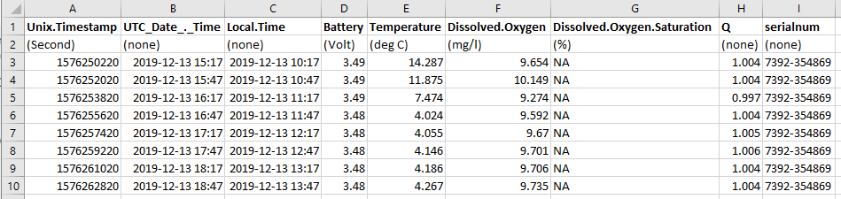
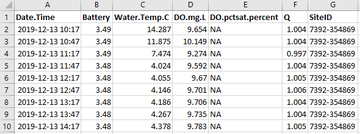

```{r setup, include=FALSE}
# ---
# title: "DataPrep_miniDOT_Reformat"
# date: '2022-06-01'
# ---
knitr::opts_chunk$set(echo = FALSE)
```

# miniDOT Reformat

The miniDOT reformat function  converts files to a format that is ready to run 
through the DataQC function. This saves you time and eliminates errors that 
sometimes occur when manually reformatting files.

## Instructions

* Click the ‘Browse’ button and select the input file(s). You can run multiple 
files at once. The status bar will tell you when the upload is complete.

* Click the ‘Reformat miniDOT file(s)’ button; a status bar will appear in the 
lower right corner.

* After the function is done running, a ‘Download’ button will appear. Click 
this button.

* Save the zipped file in the Data1_RAW folder

* Your files are now ready to be run through the QC function!

## Common errors -

*	DO percent saturation values of all NA. This occurs when no inputs are 
provided to calculate DO percent saturation, and results in. no statistics being
generated for DO percent saturation later in the QC process.

## Examples

Example images of before and and after performing reformat.





