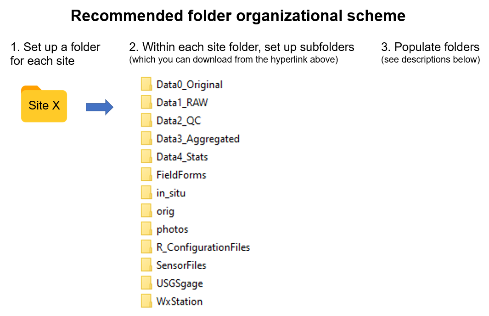

```{r setup, include=FALSE}
knitr::opts_chunk$set(results='asis', echo=FALSE, warning=FALSE, message = FALSE)
# needed for trouble shooting
boo_DEBUG <- FALSE
if(boo_DEBUG==TRUE){
  # myConfig <- file.path(system.file(package="ContDataQC"), "extdata", "config.ORIG.R")
  # source(myConfig)
}## IF ~ boo_DEBUG ~ END
```

# Organizing Files

Not everyone has access to software and data management systems that can accommodate continuous data and even if you do, there are files that will not be uploaded to the data management system that are important to retain (such as the original sensor files and field forms). 

If you don’t have a good file organization scheme, we recommend setting up folders as shown below as a starting point. Folders and files can be customized as you gain more experience. The files should be backed up regularly and accessible to other members of your data management team.

Click [here](https://github.com/Blocktt/ShinyAppDocuments/tree/main/ContDataQC/Organizing_Files) to download a zipped file with a ready-made set of (empty) folders. Simply put the file in the desired location, unzip it and then replace ‘SiteX’ with the appropriate site name.

The Shiny app allows for more flexibility with the folder scheme than the R package. For example, you don’t need to name the folders exactly as shown below because you can browse to the desired input files and browse to save the output files to the desired location. However, if you decide to use the R package at some point, keeping the four ‘Data’ folders (Data0_Original, Data1_RAW, Data2_QC, Data3_Aggregated and Data4_Stats) will be important since the R code looks for and outputs files to these directories (although advanced R users can modify these default directories if desired). If you use the folder scheme below, it will give you more flexibility to go back and forth between using the R package and Shiny app.

```{r, echo=FALSE, out.width="60%"}

```


### Folder descriptions
```{r table_1}
library(readxl)
library(knitr)
library(kableExtra)
# state directories
table.dir <- "tables"
table.file <- "App_Information_Tables.xlsx"
tab2a.dir <- "DataPrep_Table2a"

table2a <- read_excel(file.path(table.dir, table.file), sheet = tab2a.dir
                     , na = c("NA", ""), trim_ws = TRUE, skip = 0
                     , col_names = TRUE)  

options(knitr.kable.NA = '')
# kable(table1)
table2a %>% 
  kbl() %>% 
  kable_styling(full_width = F, position = "left")
```

Users have more flexibility with file organization when using the Shiny app vs R package because you can navigate/browse between folders
