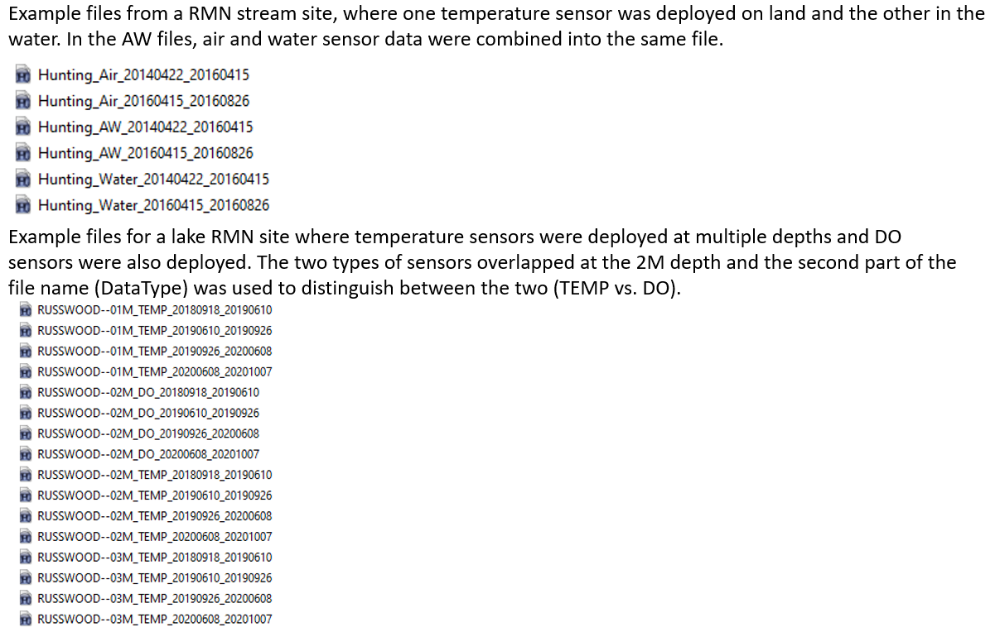

```{r setup, include=FALSE}
knitr::opts_chunk$set(results='asis', echo=FALSE, warning=FALSE, message = FALSE)
# needed for trouble shooting
boo_DEBUG <- FALSE
if(boo_DEBUG==TRUE){
  # myConfig <- file.path(system.file(package="ContDataQC"), "extdata", "config.ORIG.R")
  # source(myConfig)
}## IF ~ boo_DEBUG ~ END
```

# Naming Files

You have more flexibility with naming files when using the Shiny app vs R 
package because you can browse to the desired input file(s), whereas the R 
package searches through files in a specified directory and selects data files 
based on the file name. Even if you are using the Shiny app, consider using the 
file naming scheme below since you may decide to use the R package at some point
in the future. Another reason to use the recommended file naming scheme is 
because it keeps files well organized and easy to sort. For example, if using 
HOBO U20 water level loggers, it makes matching air and water sensor files 
easier during the processing step and helps you identify gaps in the data.
The recommended file naming scheme is:

The recommended file naming scheme is: 

**SiteID_DataType_StartDate_EndDate**

The four components are separated by underscores (“_”).

Example: Hunting_Water_20130426_20130725

* Site ID (no spaces or underscores) = Hunting

*	DataType: Air, Water, AW (air and water sensor data are combined into the same
file), Gage, DO

* Date, Start (YYYYMMDD) = 20130426

* Date, End (YYYYMMDD) = 20130725

For multi-depth deployments (e.g., temperature sensors deployed at multiple 
depths at a lake), depth and units are added to the SiteID, separated by 
double-dashes as shown below: 

Example: RussWood--01M_TEMP_20130426_20130725

Depth can include decimals (for example, 0.1M is ok) and does not need to 
include leading zeros (either 01M or 1M are acceptable). Units can be upper or 
lower case (M or m), and abbreviated (M) or spelled out (meters). You can change
the double-dash separator if desired by customizing the 
[configuration file](Config_default.zip) (for example, you could change it to a
tilde ~).

If you are using the Shiny app and have more than one type of sensor deployed at
the same depth (for example, both a DO and temperature sensor at 2M), you can 
put the sensor type in the second part of the file name (for example, DataType = 
TEMP, as shown in the example above, or DataType = DO).

Below are examples of files that follow the recommended naming scheme.


