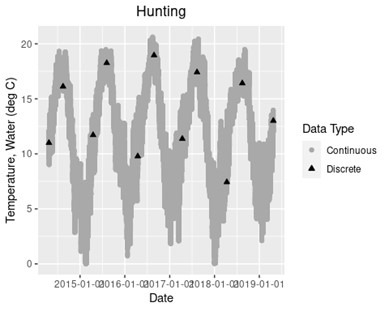

```{r setup, include=FALSE}
knitr::opts_chunk$set(results='asis', echo=FALSE, warning=FALSE, message = FALSE)
# needed for trouble shooting
boo_DEBUG <- FALSE
if(boo_DEBUG==TRUE){
  # myConfig <- file.path(system.file(package="ContDataQC"), "extdata", "config.ORIG.R")
  # source(myConfig)
}## IF ~ boo_DEBUG ~ END

# 20230911, new tab from Jen's "updates"
```

# Discrete Data

Discrete (in situ) measurements can be entered for any parameter. This needs to be done manually after the input file has been formatted (for example, after a HOBO file has been run through the Reformat function). Just add a new column into the input file and use the following naming scheme for the column heading: parameter name and units, with ‘Discrete’ at the beginning (for example, ‘Discrete Air Temp C’). The discrete data point(s) will be included in the time series plots in the Word or html QC reports that are generated when the user runs the QC function (below is an example). 

Discrete measurements are important for validating your data, and in some cases, can be used to correct for sensor drift. Accuracy checks are comparisons of discrete or in situ measurements taken in the lab and/or in the field with sensor measurements from the closest date/time. The sensor measurement should be within the accuracy quoted by the manufacturer (e.g., ±0.2°C if you are using the Onset HOBO proV2 sensor). Click [here](EXAMPLE_AccuracyCheckWkst.xlsx) to download an example of an accuracy check worksheet being kept by an RMN partner.


